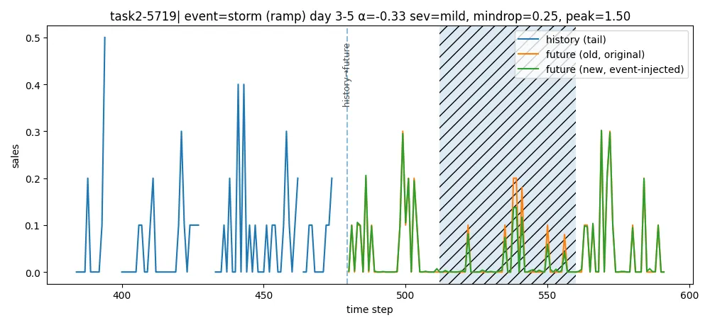
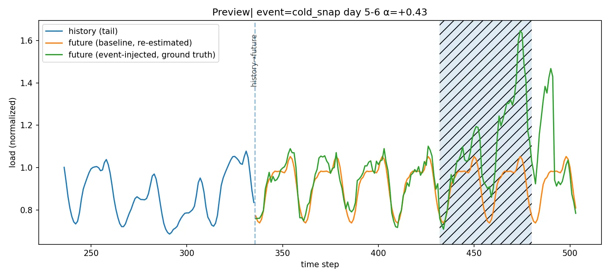
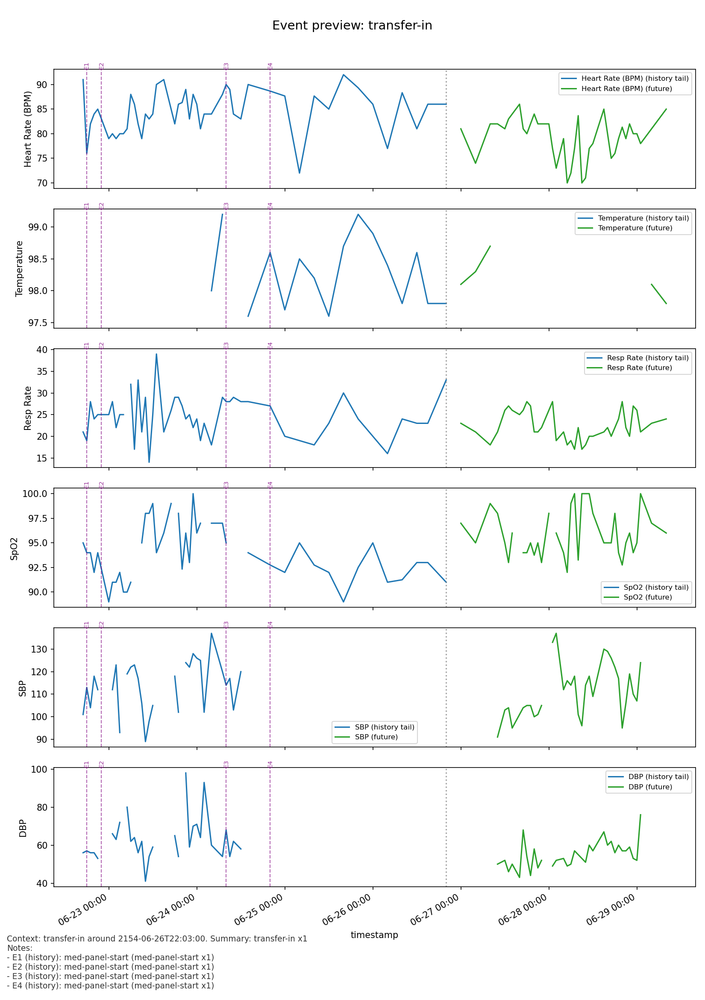
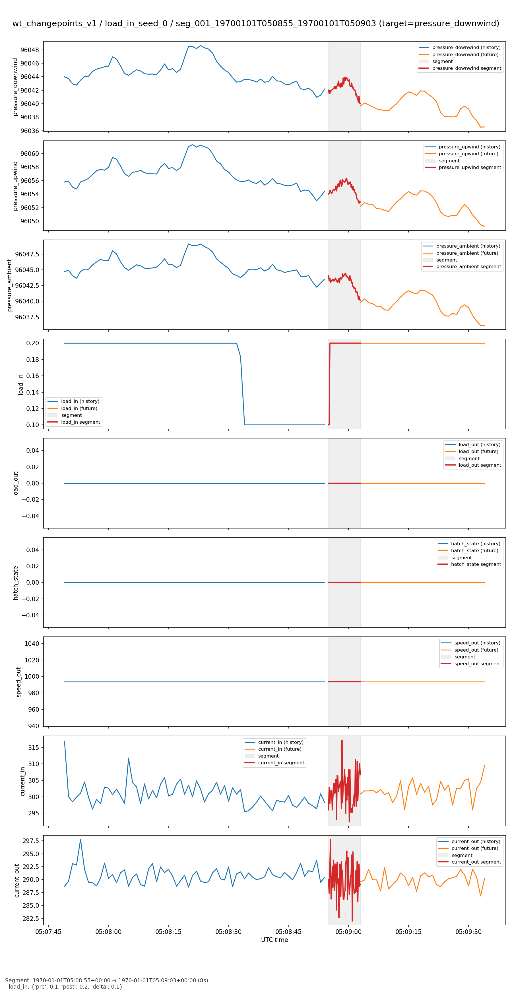

# TS-Benchmark

## Orignal Dataset

*  Freshretailnet-50K

  * Paper (https://arxiv.org/abs/2505.16319) Data (https://huggingface.co/datasets/Dingdong-Inc/FreshRetailNet-50K)

  * A Stockout-Annotated Censored Demand Dataset for Latent Demand Recovery and Forecasting in Fresh Retail

* PSML

  * Paper (https://www.nature.com/articles/s41597-022-01455-7) Data (https://zenodo.org/records/5663995)
  * A multi-scale time-series dataset with benchmark for machine learning in decarbonized energy grids 

* MIMIC

  * Paper (https://www.nature.com/articles/s41597-022-01899-x) Data (https://physionet.org/content/mimiciv/3.1/)

  * a freely accessible electronic health record dataset

* Causal Chambers

  * Paper (https://www.nature.com/articles/s42256-024-00964-x) Data (https://causalchamber.ai/)

  * a real-world physical testbed for AI methodology

## Task Design

### Task Category

|                | understanding task | prediction task |
| -------------- | ------------------ | --------------- |
| Non-contextual | T1.                | T2.             |
| Contextual     | T3.                | T4.             |

* context includes background information, task descriptions, future event descriptions.  

### T1 Task: Non-contextual understanding task

* Focus on historical time series.

| **Task Type**   | **Options**                                                | **Label Construction**                                       |
  | --------------- | ---------------------------------------------------------- | ------------------------------------------------------------ |
  | **Trend**       | up / down / flat / Uncertain                               | Compute robust slope (Theil–Sen) on the tail or full window. ≥ +bar → up; ≤ −bar → down; |
  | **Volatility**  | increased / decreased / constant / Uncertain               | MAD_future / MAD_history ≥ 1.3 → increased; ≤ 0.8 → decreased; in [0.95, 1.05] → constant; else Uncertain. |
  | **Seasonality** | fixed / shifting / no / Uncertain                          | Compare peak positions & amplitudes (smoothed). If both amplitudes < 0.5×IQR → no; |
  | **Outlier**     | sudden spike / level shift / stable no outlier / Uncertain | Detect single-point ≥ q95+3×MAD → spike; sustained median shift ≥ bar over ≥ H samples → level shift; else stable; uncertain if ambiguous. |

```
=== T1 Task Example ===

[Question]
Task:
- Based on the following arrays (length=480), answer FOUR multiple-choice questions about the main series.
- Do not use any external knowledge. Output only the JSON object.

Questions (pick EXACTLY one option for each):
1) Trend: {"upward", "downward", "constant"}
2) Volatility: {"increased", "decreased", "constant"}
3) Seasonality: {"fixed", "shifting", "none"}
4) Outliers: {"sudden_spike", "level_shift", "stable"}
```

### T2 Task: Non-contextual prediction task

* Given the historical time series, predict the future time series.
* We have two kinds of tasks: **multiple-choice questions** and **prediction tasks**. 
* Similar to T1 Task, here multiple-choice task including questions about **Trend**, **Volatility** and **Seasonality**.

```
=== T2 Task Example ===

[Question]
Task:
- Using only the provided history and aligned future covariates, forecast the next 112 steps of the main series.
- Treat NaN as missing; avoid leakage from future targets.
- After forecasting, answer the multiple-choice questions based solely on the observed data (no external context).

Multiple-choice questions:
Q1) Median demand level change (forecast horizon vs history)? {Higher, Lower, Similar, Uncertain}}
Q2) Volatility change (forecast horizon vs history)? {increased, decreased, constant, Uncertain}}
Q3) Seasonality alignment between history and forecast? {fixed, shifting, no, Uncertain}}
```


### T3 Task: Contextual unserstanding task

* Given some context, do the understanding task on historical time series.

#### LLM Ability Assessment

* **C1 Alignment** (mapping colloquial conditions to correct fields/thresholds/windows)
* **C2 Slicing** (comparing segments by time/state/group)
* **C3 Difference Judgment** (using median, interquartile range, or effect size)
* **C4 Lag** (detecting delay or response window)
* **C5 Structure** (analyzing peaks, periods, rhythms, shapes, and change points)
* **C6 Interaction Understanding** (analyzing “difference-in-difference” when two conditions overlap, e.g., discount × weather)

#### Task Family and examples

##### Freshretailnet-50K

* 26 different tasks

  | Family | Sub-task (ID) | **Capabilities (C1–C6)** | Brief capability                      | Example question (code-aligned)                              | Labels                                                       | Auto-label summary (matches code)                            |
  | ------ | ------------- | ------------------------ | ------------------------------------- | ------------------------------------------------------------ | ------------------------------------------------------------ | ------------------------------------------------------------ |
  | **S1** | S1:A          | **C1, C2, C3**           | Overall promotion uplift              | Does promotion (vs. baseline price) increase overall median sales? | Yes / No / Uncertain                                         | Removes seasonality, compares median sales for has-discount vs baseline; median ratio (or scaled diff) is checked against an adaptive bar. |
  |        | S1:B          | **C1, C2, C3**           | Daypart promotion sensitivity         | Among Morning/Noon, Late afternoon, and Evening, which bucket shows the strongest promotion uplift? | A Morning/Noon / B Late afternoon / C Evening / D None prominent | Computes uplift per daypart from deseasonalized medians; picks the slot with largest absolute uplift if it beats the bar, otherwise returns D. |
  |        | S1:C          | **C1, C2, C3**           | Evening vs morning uplift contrast    | Is promotion uplift stronger in Evening than in Morning/Noon? | A Morning/Noon / B Evening / C Similar / D Inconclusive      | Compares evening and morning promotion uplifts; the difference versus the bar chooses Morning, Evening, Similar, or Inconclusive. |
  | **S2** | S2:A          | **C1, C2, C3, C6**       | Rain penalty by slot (no price split) | Is the relative sales penalty of heavy rain vs clear the largest in the evening? | A Morning/Noon / B Late afternoon / C Evening / D None       | Heavy–clear median gaps per daypart are evaluated; the biggest absolute gap over the bar wins, else D. |
  |        | S2:B          | **C1, C2, C3, C6**       | Discount buffer under heavy rain      | Is the Deep–Shallow gap larger under heavy rain than under clear periods? | Yes / No / Uncertain                                         | Calculates (Deep−Shallow) under heavy vs clear precipitation; difference scaled by median level vs threshold drives the verdict. |
  |        | S2:C          | **C1, C2, C3, C6**       | Slot with strongest rain buffer       | During heavy precipitation, which time-of-day bucket shows the largest Deep–Shallow gap? | A Morning/Noon / B Late afternoon / C Evening / D None       | For heavy-rain slices, compares deep–shallow gaps per slot; picks the largest if above the bar, otherwise D. |
  |        | S2:D          | **C1, C2, C3, C6**       | Monotonic rain–discount synergy       | Does the Deep–Shallow gap increase from clear → mild → heavy precipitation? | Yes / No / Uncertain                                         | Tests whether gaps for clear, mild, heavy satisfy monotonic growth within tolerance; strong violation gives No, borderline gives Uncertain. |
  |        | S2:E          | **C1, C2, C3, C6**       | Discount–sales association shift      | Is the absolute association between discount multiplier and sales stronger under heavy rain than under clear? | Yes / No / Uncertain                                         | Compares absolute Spearman correlations.                     |
  |        | S2:F          | **C1, C2, C3, C6**       | Discount reduces rain penalty         | Is the absolute rain penalty smaller under deep discount than under shallow discount? | Yes / No / Uncertain                                         | Computes heavy–clear penalties for shallow vs deep buckets; if deep penalty is lower beyond threshold → Yes, higher → No, else Uncertain. |
  | **S3** | S3:A          | **C1, C2, C3**           | Larger gain step                      | Between moving from L3→L2 and from L2→L1 (deeper discount bands), which step yields a larger relative sales gain? | A First segment / B Second segment / C Similar / D Inconclusive | Evaluates deseasonalized medians per band; compares relative gains of adjacent steps with uncertainty margin. |
  |        | S3:B          | **C1, C2, C3**           | Diminishing returns across bands      | Across discount bands L4→L3→L2→L1, does the per-step relative sales increase show a diminishing pattern? | Yes / No / Uncertain                                         | Checks monotonic decline of step gains.                      |
  |        | S3:C          | **C1, C2, C3**           | Incremental elasticity contrast       | Is the incremental elasticity larger in the first step (L3→L2) than in the second step (L2→L1)? | Yes / No / Uncertain                                         | Uses median sales and multipliers to approximate elasticity per step; compares difference against ±margin. |
  |        | S3:D          | **C1, C2, C3**           | Ultra-deep discount saturation        | Comparing transitions {L2→L1(b)} vs {L1(b)→L1(a)}, is there evidence of saturation at the deepest level? | Yes / No / Uncertain                                         | Splits deepest band, contrasts relative gains; if deepest increment shrinks below margin → Yes, exceeds → No. |
  |        | S3:E          | **C1, C2, C3**           | Evening vs morning elasticity         | Is price elasticity stronger in the evening than in morning/noon? | Yes / No / Uncertain                                         | Computes deep−shallow gaps normalized by multiplier differences; difference vs margin yields label. |
  | **S4** | S4:A          | **C1, C2, C3, C5**       | Peak timing shift                     | Compared to low/no discount periods, do high-discount periods shift the main peak earlier or later? | A Earlier / B Later / C Unchanged / D Inconclusive           | Finds peak slot for high vs low discounts; ≥2-slot shift sets Earlier/Later. |
  |        | S4:B          | **C1, C2, C3, C5**       | Peak concentration                    | Under high discount, is the intra-day peak more concentrated (narrower) or more spread out? | A Narrower / B Wider / C Similar / D Inconclusive            | Computes std of slot medians for high vs low; ±10 % change signals Narrower/Wider. |
  |        | S4:C          | **C1, C2, C3, C5**       | Secondary peak emergence              | Under high discount, does a secondary peak emerge compared to low/no discount? | Yes / No / Uncertain                                         | Checks if ≥2 slots reach ≥90 % of max; appearance only in high → Yes, only in low → No. |
  |        | S4:D          | **C1, C2, C3, C5**       | Peak prominence                       | Under high-discount periods, is the peak-to-median ratio higher than under low/no discount? | Yes / No / Uncertain                                         | Compares peak/median ratios high vs low.                     |
  |        | S4:E          | **C1, C2, C3, C5**       | Peak stability (low/no discount)      | Is the intra-day peak hour consistent (±1 slot) across consecutive weeks during low/no discount periods? | Stable / Unstable / Inconclusive                             | Derives daily peaks under low/no discount, measures share within ±1 of modal slot. |
  | **S5** | S5:A          | **C1, C2, C3, C5**       | Holiday uplift map                    | On holidays, relative to normal days, in which time-of-day bucket does the largest uplift usually occur? | A Morning/Noon / B Late afternoon / C Evening / D None       | Evaluates holiday vs normal medians per slot.                |
  |        | S5:B          | **C1, C2, C3, C5**       | Holiday peak shift                    | Do holidays shift the main peak earlier or later compared with normal days? | A Earlier / B Later / C Unchanged / D Inconclusive           | Compares peak slots for holiday vs normal slices.            |
  |        | S5:C          | **C1, C2, C3, C5**       | Holiday evening uplift                | On holidays, is the evening median sales higher than on normal days? | Yes / No / Uncertain                                         | Computes evening median ratio holiday vs normal.             |
  | **S6** | S6:A          | **C1, C2, C3, C4**       | Next-day noon recovery                | On the day after heavy rain, is there a stronger noon recovery compared to the day after a clear day? | Yes / No / Uncertain                                         | Aggregates noon differences for heavy vs clear days.         |
  |        | S6:B          | **C1, C2, C3, C4**       | Recovery horizon                      | After heavy rain, is the recovery stronger on the next day or the second day? | A Next day / B Second day / C Similar / D Inconclusive       | Compares evening gains of day + 1 vs day + 2.                |
  |        | S6:C          | **C1, C2, C3, C4**       | Second-day evening overshoot          | After a heavy-rain day, is the evening sales on the second day higher than the day immediately after? | Yes / No / Uncertain                                         | Median of (day + 2 evening − day + 1 evening) relative to threshold. |
  |        | S6:D          | **C1, C2, C3, C4**       | Noon vs evening recovery shape        | On the day after a heavy-rain day, is the noon recovery stronger than the evening recovery? | A Noon stronger / B Evening stronger / C Similar / D Inconclusive | Compares noon vs evening increments on day + 1.              |

##### PSML

* 25 task

  | Family | Sub-task (ID) | **Capabilities (C1–C6)** | Brief capability                          | Example question (from code)                                 | Labels                                                    | Auto-label summary (matches code)                            |
  | ------ | ------------- | ------------------------ | ----------------------------------------- | ------------------------------------------------------------ | --------------------------------------------------------- | ------------------------------------------------------------ |
  | **S1** | S1:A          | **C1, C2, C3**           | Nighttime spike attribution               | “A sharp nighttime load rise is observed. Does it coincide with a temperature drop?” | Yes / No / Uncertain                                      | Evening load vs prior-6h baseline, plus Spearman between load and −ΔTemperature; strong positive link or uplift → Yes, negative → No, weak signals → Uncertain. |
  |        | S1:B          | **C1, C2, C3**           | Weekend evening uplift                    | “Are weekend evenings significantly higher than weekday evenings?” | Yes / No / No clear change / Uncertain                    | Median weekend-evening vs weekday-evening; ≥+8% → Yes, ≤−8% → No, within ±4% → No clear change, mid-range → Uncertain. |
  |        | S1:C          | **C1, C2, C3**           | Low-irradiance evening impact             | “On low-irradiance evenings, is load higher than other evenings?” | Higher / Lower / Similar / Uncertain                      | Splits evening load by GHI ≤ q0.40 vs others; relative median difference ≥±8% sets Higher/Lower, ≤4% → Similar, else Uncertain. |
  |        | S1:D          | **C1, C2, C3**           | Hot-day late-afternoon vs morning         | “On hot days, is late-afternoon load higher than morning?”   | Yes / No / Similar / Uncertain                            | Compares late-afternoon vs morning medians on hot subset; ≥8% → Yes, ≤−8% → No, within ±4% → Similar, otherwise Uncertain. |
  |        | S1:E          | **C1, C2, C3**           | Hot low-wind association                  | “During high temperature, do low-wind periods show higher load than high-wind periods?” | Yes / No / Uncertain                                      | Hot & low-wind vs hot & high-wind medians; difference ≥±8% produces Yes/No, within ±4% → Uncertain. |
  | **S2** | S2:A          | **C1, C2, C3, C4**       | Post-heatwave recovery lag                | “After a heatwave, how long until load returns to baseline?” | Next day / 2nd day / ≥3 days / Unclear                    | Identifies heatwave, compares day medians to pre-baseline; first day within ±5% selects Next/2nd/≥3; missing recovery → Unclear. |
  |        | S2:B          | **C1, C2, C3, C4**       | Low-irradiance lag effect                 | “Does a strong low-irradiance day reduce load immediately or with a delay?” | Immediate / Lagged / No effect / Uncertain                | For low GHI days compares day vs previous (immediate) and next day (lag); whichever exceeds ±8% decides, both near zero → No effect, ambiguous → Uncertain. |
  |        | S2:C          | **C1, C2, C3, C4**       | GHI-drop impact timing                    | “After a sharp GHI drop, when does the load response most often appear?” | 0–1h / 2–3h / 4–6h / Uncertain                            | Finds shocks (G ≤ 40% rolling median), tracks normalized responses 0–6h; median lag of strongest effect bucketizes, insufficient events → Uncertain. |
  |        | S2:D          | **C1, C2, C3, C4**       | Temperature surge persistence             | “Does evening load remain elevated into the night after a hot afternoon?” | Yes / No / Uncertain                                      | Hot-evening vs following-night medians; ≥±8% difference → Yes/No, within ±4% → Uncertain. |
  |        | S2:E          | **C1, C2, C3, C4**       | Cross-lag dominance                       | “Which driver shows stronger lagged association with load?”  | Temperature / GHI / Similar / Uncertain                   | Computes max absolute Spearman for load lagged 1–6h against Temp and GHI; difference ≥0.10 decides Temp/GHI, both decent & close → Similar, weak → Uncertain. |
  | **S3** | S3:A          | **C1, C2, C3, C5**       | Week-over-week peak timing shift          | “Has the daily peak shifted relative to the previous week?”  | Earlier / Later / Stable / Unclear                        | Mean peak hour last 7 days vs prior week; shift ≤−2h → Earlier, ≥2h → Later, <2h → Stable, insufficient days → Unclear. |
  |        | S3:B          | **C1, C2, C3, C5**       | Secondary evening peak emergence          | “Did a new secondary evening peak appear in this period?”    | Yes / No / Uncertain                                      | Counts evening hours with hourly medians ≥90% of max; ≥2 → Yes, ≤1 → No, else Uncertain. |
  |        | S3:C          | **C1, C2, C3, C5**       | Peak width change                         | “Is the peak more concentrated (narrower) than before?”      | Narrower / Wider / Similar / Uncertain                    | Std of hourly medians in first vs second half; ≥±10% change → Narrower/Wider, otherwise Similar. |
  |        | S3:D          | **C1, C2, C3, C5**       | Midnight base-load drift                  | “Has base load (00–04) drifted relative to earlier period?”  | Up / Down / Stable / Uncertain                            | Midnight medians first half vs second; ≥±8% → Up/Down, ≤4% → Stable, otherwise Uncertain. |
  |        | S3:E          | **C1, C2, C3, C5**       | Intra-day profile similarity              | “Did the intra-day shape change materially?”                 | Changed / Similar / Uncertain                             | Cosine similarity of hourly profiles between halves; ≤0.90 → Changed, ≥0.95 → Similar, intermediate → Uncertain. |
  | **S4** | S4:A          | **C1, C2, C3, C6**       | Weekend × Temperature DiD                 | “On weekends, does high temperature raise load more than on weekdays?” | Yes / No / Uncertain                                      | Difference-in-differences of (hot−normal) evening load weekend vs weekday scaled by baseline; ≥±8% → Yes/No, ≤4% → Uncertain. |
  |        | S4:B          | **C1, C2, C3, C6**       | Weekday vs weekend irradiance sensitivity | “Is irradiance sensitivity stronger on weekdays than weekends (evening)?” | Weekday stronger / Weekend stronger / Similar / Uncertain | Absolute Spearman of GHI vs load for weekday vs weekend evenings; difference ≥0.10 picks stronger side, both sizable & close → Similar, weak → Uncertain. |
  |        | S4:C          | **C1, C2, C3, C6**       | Temperature × Humidity interaction        | “Under high humidity, does high temperature push load more (evening)?” | Yes / No / Uncertain                                      | Evening DiD across (hot/cold × humid/dry); normalized effect ≥±8% → Yes/No, within ±4% → Uncertain. |
  |        | S4:D          | **C1, C2, C3, C6**       | Hot × Low-wind effect                     | “Under hot & low-wind, is load higher than hot & high-wind (evening)?” | Yes / No / Uncertain                                      | Hot low-wind vs hot high-wind evening medians; ≥±8% → Yes/No, within ±4% → Uncertain. |
  |        | S4:E          | **C1, C2, C3, C6**       | Evening vs noon sensitivity               | “Is driver sensitivity stronger in evening than in noon?”    | Evening / Noon / Similar / Uncertain                      | For Temperature or GHI chooses driver with greatest differential correlation or median gap per slot. |
  | **S5** | S5:A          | **C1, C2, C3, C4, C5**   | Post-storm rebound                        | “After storm-like low irradiance, does the next day show an overshoot in load?” | Yes / No / Uncertain                                      | Compares D+1 vs D−1 medians around low-GHI events; median effect ≥±8% → Yes/No, ≤4% → Uncertain. |
  |        | S5:B          | **C1, C2, C3, C4, C5**   | Heatwave after-effect duration            | “For how long after a heatwave does load stay elevated?”     | <1 day / 2–3 days / ≥4 days / Unclear                     | Tracks first day with <5% excess vs baseline; assigns duration bucket, missing recovery → ≥4 days or Unclear. |
  |        | S5:C          | **C1, C2, C3, C4, C5**   | Recovery horizon (evening)                | “Is recovery stronger on the next day or the second day (evening)?” | Next / Second / Similar / Uncertain                       | For low-GHI events, compares evening gains D+1−D vs D+2−D+1; median sign chooses Next/Second. |
  |        | S5:D          | **C1, C2, C3, C4, C5**   | Noon vs evening recovery (D+1)            | “On D+1, is noon recovery stronger than evening?”            | Noon / Evening / Similar / Uncertain                      | Computes (noon gain − evening gain) for D+1; sign beyond ±4% selects Noon/Evening, else Similar. |
  |        | S5:E          | **C1, C2, C3, C4, C5**   | Half-life decay within 2 days             | “Does the post-event elevation halve within two days?”       | Yes / No / Uncertain                                      | Counts events where D+2 excess ≤ 0.5×D or ≥0.8×D; majority yes/no (≥⅓ of total) chooses verdict, otherwise Uncertain. |

##### MIMIC

* 27 task

  | Family  | Sub-task (ID) | **Capabilities (C1–C6)**                                     | Brief capability                 | Example question (code-aligned)                              | Labels                                | Auto-label summary (matches code)                            |
  | ------- | ------------- | ------------------------------------------------------------ | -------------------------------- | ------------------------------------------------------------ | ------------------------------------- | ------------------------------------------------------------ |
  | **S1**  | S1-A          | **C1 Alignment**, **C2 Slicing**, **C3 Difference Judgment** | Fever impact on HR               | During fever episodes (Temp ≥ 37.2 °C), is heart rate higher than normal? | Higher / Lower / Similar / Uncertain  | Compares median HR for fever vs non-fever; relative change vs ±bar selects direction. |
  |         | S1-B          | **C1–C3**                                                    | Low SBP tachycardia check        | When SBP ≤ lower quartile, is heart rate elevated?           | Yes / No / Uncertain                  | Splits HR by SBP ≤ Q25 vs > Q25; median difference beyond bar → Yes/No. |
  |         | S1-C          | **C1–C3**                                                    | High RR association              | Comparing high RR (≥ median + 5) and low RR, whose heart rate is higher? | HighRR / LowRR / Similar / Uncertain  | Uses HR medians for RR extremes; threshold decides label.    |
  |         | S1-D          | **C1–C3**                                                    | Night vs day HR                  | Comparing night (0–5 h) and day (10–17 h), is HR higher at night? | Higher / Lower / Similar / Uncertain  | Contrasts night vs day medians; relative change vs threshold. |
  |         | S1-E          | **C1–C3**                                                    | Hypoxemia response               | When SpO₂ ≤ 92 %, is HR increased?                           | Yes / No / Uncertain                  | HR under SpO₂ ≤ 92 % vs > 92 %; relative uplift beyond bar.  |
  | **S2**  | S2-A          | **C1–C3**, **C5 Structure**                                  | Trend detection                  | Over the recent history, what is the heart-rate trend?       | Rising / Falling / Flat / Uncertain   | Linear slope vs TREND_SLOPE_BAR defines direction.           |
  |         | S2-B          | **C1–C3**, **C5**                                            | Volatility level                 | How volatile is heart rate during the history window?        | High / Low / Moderate / Uncertain     | MAD/median ratio vs volatility thresholds.                   |
  |         | S2-C          | **C1–C3**                                                    | Early vs late comparison         | Compared to first 10 min, is HR higher in last 10 min?       | Higher / Lower / Similar / Uncertain  | Medians first vs last segment → relative change.             |
  |         | S2-D          | **C1–C3**, **C4 Lag**                                        | Post-hypoxia recovery            | After SpO₂ recovers, does HR return to baseline within 10 min? | Yes / No / Uncertain                  | Medians before/after last low SpO₂ episode.                  |
  |         | S2-E          | **C1–C3**, **C5**                                            | Sustained tachycardia            | Does HR stay above 90th percentile ≥ 5 min?                  | Yes / No / Uncertain                  | Longest streak count threshold.                              |
  | **S3**  | S3-A          | **C1–C4**                                                    | RR → HR lag estimation           | After RR increases, what is the delay before HR responds?    | 0–2 / 3–5 / 6–10 / Uncertain          | Cross-correlation lag bucket.                                |
  |         | S3-B          | **C1–C4**                                                    | SBP drop response timing         | After low SBP episodes, is HR response immediate?            | Immediate / Lagged / None / Uncertain | Next-minute HR change vs baseline.                           |
  |         | S3-C          | **C1–C4**, **C5**                                            | Fever-induced elevation duration | After fever onset, how long does HR stay elevated?           | <5 / 5–10 / >10 / Uncertain           | Minutes until HR returns near baseline.                      |
  |         | S3-D          | **C1–C4**                                                    | HR decay delay after high RR     | After high RR ends, does HR take ≥ 3 min to decline?         | Yes / No / Uncertain                  | Delay from RR fall to HR peak.                               |
  |         | S3-E          | **C1–C4**                                                    | SpO₂ drop response lag           | After SpO₂ drop ≤ 92 %, is HR peak delayed > 2 min?          | Yes / No / Uncertain                  | Detect delay between SpO₂ drop and HR peak.                  |
  | **S4**  | S4-A          | **C1–C3**, **C5 Structure**                                  | Multiple peak detection          | Are there multiple pronounced HR peaks in history window?    | Yes / No / Uncertain                  | Count excursions > 90th percentile.                          |
  |         | S4-B          | **C1–C3**, **C5**                                            | Peak timing vs midpoint          | Is main HR peak earlier or later than midpoint?              | Earlier / Later / Stable / Uncertain  | Max index offset classification.                             |
  |         | S4-C          | **C1–C3**, **C5**                                            | Baseline shift (low tail)        | Did lowest 10 % HR shift vs earlier half?                    | Up / Down / Stable / Uncertain        | q10 first vs second half → relative change.                  |
  | **S5**  | S5-A          | **C1–C3**, **C6 Interaction Understanding**                  | SpO₂×RR joint effect             | Do low SpO₂ and high RR jointly elevate HR?                  | Yes / No / Uncertain                  | 2×2 double-difference of medians vs bar.                     |
  |         | S5-B          | **C1–C3**, **C6**                                            | SBP×RR joint effect              | Do low SBP and high RR jointly elevate HR?                   | Yes / No / Uncertain                  | Same interaction test (SBP-low × RR-high).                   |
  |         | S5-C          | **C1–C3**, **C6**                                            | SBP×Temp synergy                 | Do low SBP and high Temp jointly elevate HR?                 | Yes / No / Uncertain                  | Double-difference on SBP-low × fever.                        |
  |         | S5-D          | **C1–C3**, **C6**                                            | Night×Temp interaction           | Is HR increase stronger when night coincides with fever?     | Yes / No / Uncertain                  | Night vs day crossed with fever.                             |
  |         | S5-E          | **C1–C3**, **C6**                                            | SpO₂×Temp variability            | Do low SpO₂ and fever jointly increase HR variability?       | Yes / No / Uncertain                  | MAD-based interaction on 2×2 cells.                          |
  |         | S5-F          | **C1–C3**, **C6**                                            | RR×Temp variability              | Does high RR combined with fever increase HR variability?    | Yes / No / Uncertain                  | MAD-based interaction using RR-high × fever.                 |
  | **EVT** | EVT1          | **C1–C3**, **C4 Lag**                                        | Medication event effect          | Within 10 min after med start, does HR go up or down?        | Up / Down / Similar / Uncertain       | Pre/post 10 min window comparison.                           |
  |         | EVT2          | **C1–C3**, **C4 Lag**                                        | Procedure effect                 | Before vs after procedure (± 10 min), how does HR change?    | Up / Down / Similar / Uncertain       | Same pre/post comparison around procedure.                   |
  |         | EVT3          | **C1–C3**, **C4 Lag**                                        | Transfer-in response             | Comparing 10 min before and after transfer-in, which period has higher HR? | Before / After / Similar / Uncertain  | HR comparison around transfer-in event.                      |

##### Causal chambers

* 9 tasks

  | Family | Sub-task (ID) | **Capabilities (C1–C6)**                                     | Brief capability               | Example question (code-aligned)                              | Labels                               | Auto-label summary (matches code)                            |
  | ------ | ------------- | ------------------------------------------------------------ | ------------------------------ | ------------------------------------------------------------ | ------------------------------------ | ------------------------------------------------------------ |
  | **S1** | S1-A          | **C1 Alignment**, **C2 Slicing**, **C3 Difference Judgment** | Load regime comparison         | For high-load (load_in ≥ q0.70) vs low-load (≤ q0.30), which regime has higher median target? | Higher / Lower / Similar / Uncertain | Split history by load_in quantiles; compare medians of median-filtered target. Δ≥bar → Higher, ≤−bar → Lower, within band → Similar, else Uncertain. |
  |        | S1-B          | **C1–C3**, **C5 Structure**                                  | Volatility shift               | Compare MAD of the target between early and late halves of the window; which half is more volatile? | Higher / Lower / Similar / Uncertain | Compute MAD for early vs late halves; difference vs bar/unc_band selects Higher/Lower/Similar; mid-range yields Uncertain. |
  |        | S1-C          | **C1–C3**, **C6 Interaction Understanding**                  | Stable vs ramping regimes      | Contrast target medians when load change is “stable” (Δload ≤ q0.40) vs “ramping” (≥ q0.60); which is higher? | Higher / Lower / Similar / Uncertain | Compare medians between stable vs ramping load-change subsets; large relative difference vs threshold → Higher/Lower, else Similar/Uncertain. |
  | **S2** | S2-A          | **C1–C4**, **C5 Structure**                                  | Target vs load lag             | Does the target lead, lag, or stay in-phase with load_in changes? | Leads / Lags / In-phase / Uncertain  | First-difference target & load_in; compute cross-correlation; strongest positive lag decides Leads/Lags; low correlation → Uncertain. |
  |        | S2-B          | **C1–C4**                                                    | Current response delay         | Does current_in show a clear delay relative to load_in?      | Yes / No / Uncertain                 | First-difference current & load; if max correlation at lag>0 → Yes, near 0 → No, weak signal → Uncertain. |
  | **S3** | S3-A          | **C1–C3**, **C5 Structure**                                  | Sustained high cluster         | Does the history contain ≥5 consecutive samples above the 90th percentile of the target? | Yes / No                             | Median-filter target, compute q0.90, check for runs of length ≥5; presence → Yes, otherwise No. |
  |        | S3-B          | **C1–C3**, **C5**                                            | Tail trend detection           | In the last 25% of the window, is the target trending Up, Down, or Flat? | Up / Down / Flat / Uncertain         | Compute Theil–Sen slope on tail samples; slope ≥ bar → Up, ≤ −bar → Down, within band → Flat, weak trend → Uncertain. |
  |        | S3-C          | **C1–C3**, **C5**                                            | Multi-peak current pattern     | After smoothing current_in, are there at least two prominent peaks (≥5 s apart)? | Yes / No                             | Apply median filter to current, count local peaks spaced ≥5; ≥2 → Yes, else No. |
  | **S4** | S4-A          | **C1–C3**, **C6 Interaction Understanding**                  | Load × hatch interaction (DiD) | Does “high load & open hatch” produce a significant DiD effect on the target compared with other cells? | Yes / No / Uncertain                 | Form 2×2 cells (load high/low × hatch open/closed); if any cell <3 samples → Uncertain; else compute DiD; effect ≥ bar → Yes, ≤ −bar → No, within → Uncertain. |

```
=== T3 Task Example ===

[Question]
Background:
This task assesses contextual understanding of a historical time series (no forecasting required).
You are given a 480-step hourly history with aligned auxiliary signals. All answers must be inferred from the provided history only.

Field meanings:
- "sales_censored": main observed series (history only). NaN means stock-out (demand unobserved).
- "stock_flag": optional binary indicator aligned with history.
- "discount": price multiplier in [0,1] (smaller = deeper discount; e.g., 0.80 = 20% off).
- "holiday_flag": holiday intensity indicator (higher typically indicates stronger holiday effect).
- "precipitation": precipitation level (higher usually indicates heavier rain).
- "avg_temperature": average temperature.
- "time_position_in_day": discrete time-of-day slot (0..K-1), capturing intraday seasonality.

Task:
- Answer the following questions based solely on the historical arrays. Treat NaN in "sales_censored" as missing observations (stock-out), not zero demand. Use reasonable comparisons (e.g., median/quantiles by subsets) but do not impute beyond necessity. Do NOT extrapolate or forecast future values.

[Subtasks]
1. Compared to low/no discount periods, do high-discount periods shift the main peak earlier (toward late afternoon) or later (toward evening)?
   Options: A Earlier, B Later, C Unchanged, D Inconclusive
2. Is the Deep–Shallow gap larger under heavy rain than under clear periods?
   Options: Yes, No, Uncertain
3. Comparing the last two transitions {L2→L1(b)} vs {L1(b)→L1(a)} (where L1(a) is the deepest 10%), is there evidence of saturation (smaller incremental gain at the ultra-deep level)?  We split history by the price multiplier (smaller = deeper discount): L4=top-25% (least/no discount), L3=50–75%, L2=25–50%, L1=bottom-25% (deepest discount).
   Options: Yes, No, Uncertain
4. On the day after heavy rain, is there a stronger noon recovery compared to the day after a clear day?
   Options: Yes, No, Uncertain
```

### T4 Task: Contextual prediction task

* Given the historical time series and some context, predict the future time series.

#### Event injection/detection

* Some datasets, such as **Freshretailnet-50K** and **PSML**, typically record a series of daily information without many unusual events. However, to evaluate LLM's ability to handle contextually specific events, we provide simulated future events and related time series in the context. To mitigate the uncertainty of the simulation, we also designed corresponding multiple-choice questions, including questions on future trends, volatility, and seasonality.
* For other datasets, such as **MIMIC** and **Causal Chambers**, their datasets themselves provide a large number of special events, such as patient medication events in MIMIC and some experimental operations in Causal chambers.

##### Event Examples

###### Freshretailnet-50K

* Injected Events

  * storm
  * promotion
  * holiday

* Example

  

###### PSML

* Injected Events:

  * heatwave: multi-day heatwave; temps +7–12 °C; afternoon/evening peaks stronger.
  * cold_snap: multi-day cold spell; temps −8–13 °C; heating load up (AM/PM peaks).
  * storm: dense-cloud, gusty storm; GHI down, wind up; load dips then mild rebound.
  * renew_drought (aka renewable_drought): multi-day low GHI & low wind; net load elevated.
  * eclipse: short (2–5h) midday solar drop; PV dip → midday hump in net load.
  * demand_response: DR curtailment during evening peak; small post-event rebound.
  * step_up_level: permanent baseline jump (e.g., new data center comes online).
  * step_up_trend: baseline starts rising faster over time (e.g., electrification uptake).

* Example

  

###### MIMIC

* Focus on six patient vitals: Heartrate, Temperature, ReSP Rate, SpO2, SBP, DBP
* Record Events: 
  * Transfer-in/out
  * Med-panel-start/end
  * Procedure-start/end



###### Causal Chambers

* Example Event: Sudden change of the load of the one fan controlled by the experimental 



#### 2 task type

Like T2 Task, here we have both multi-choice questions and prediction questions 

```
# example

[Question]
Background:
In retail-like demand forecasting, the observed series may contain missing values. You are given a 480-step hourly history (with aligned auxiliary signals), and aligned future covariates for the next 112 steps.

Upcoming event (context):
- Holiday intensity rising (day 4–7); historical uplift ~0%.

Field meanings:
- "sales_censored": the main target series (history only); NaN means stock-out (demand unobserved).
- "stock_flag": optional binary indicator.
- "discount": price multiplier in [0,1] (smaller = deeper discount).
- "holiday_flag": holiday intensity.
- "precipitation": precipitation level.
- "avg_temperature": average temperature.
- "time_position_in_day": discrete time-of-day slot (0..K-1).

Task:
- Use the provided history and the aligned future covariates to forecast the next 112 steps.
- Treat NaN in "sales_censored" as missing.
- Capture plausible seasonality/trend and reasonable effects from covariates and the described event.
- Keep predictions non-negative and finite.

Multiple-choice questions:
Q1) Median demand level change (forecast horizon vs history)? {Higher, Lower, Similar, Uncertain}}
Q2) Volatility change (forecast horizon vs history)? {increased, decreased, constant, Uncertain}}
Q3) Seasonality alignment between history and forecast? {fixed, shifting, no, Uncertain}}
```

